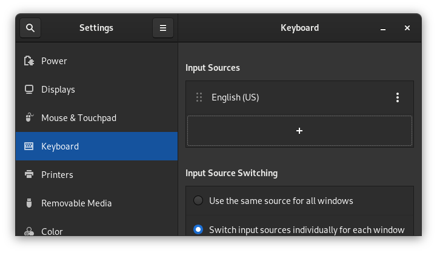
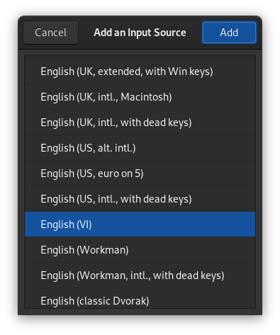

\* *This article is still a work in-progress.*

# A little bit of theory

Nestled between the num-pad and the alpha-numeric section of the keyboard lies
some special keys that are sometimes referred to as "cursor control keys".  They
serve the purpose of controlling the **view** or **cursor**.

<!-- <video src="example-of-view.webm" alt="Visual example of view definition" autoplay></video> -->

The **view** contains all of the content and the **cursor**. Scrolling is an
action that moves the **view**.

<video src="example-of-cursor.webm" alt="Visual example of cursor definition" autoplay loop></video>

The **cursor** (above) is the blinking line you see in a text field. It lets you know
that the position it's at is where new input will be placed.

All of the actions of moving the view and the cursor are controlled by the
control keys.


# A problem...

The arrow keys are too far away on a full-sized 104-key keyboard. They're too
far away from my mouse and they're too far away from the home row. I'm not here
to explain why, I'm here to complain and give a poorly thought-out solution.

I'm not a fan of taking my hands off my keyboard. I can take that further by
saying that I'm not a fan of taking my fingers off the home row. I groan each
time that I have to take my right hand off the home row to navigate a menu with
my directional keys. My uncomfortable and awkward reaching movements to hit the
down arrow with my pinky is not doing any favors for my wrist.

The bottom line is that, reaching for the control keys requires a relatively
large hand movement that we can avoid.


# ...A solution

Using a custom keyboard symbols map, we are able to extend the English (US)
keymap with some niceties.

When pressing shift you access the second level chooser, you can think of them
them as the symbols above the num-keys. We can create a [third level
chooser](https://fsymbols.com/keyboard/linux/choosers/) with our own keymap.  It's
possible to use the fourth or fifth level chooser if the third level conflicts
with your native keyboard layout. The key to access the third level chooser is
called the Compose key and is often tied to the
[AltGr](https://en.wikipedia.org/wiki/AltGr_key) key.

Many keyboards do not feature the <kbd>AltGr</kbd> key, we can remap Caps Lock to be
our compose key instead with an xkb option:
[level3(caps_switch)](https://superuser.com/questions/138708/xorg-how-can-i-map-altgr-to-the-capslock-key-to-toggle-3rd-level-symbols).

With the new symbols map and compose key remapped to `Caps Lock`, we can get
these extra key combinations:
| Key Combination                     | Action    | Xkb                                                  |
|-------------------------------------|-----------|------------------------------------------------------|
| <kbd>Caps Lock</kbd> + <kbd>H</kbd> | Left      | `key <AC06> { [ h, H, Left ] };`                     |
| <kbd>Caps Lock</kbd> + <kbd>J</kbd> | Down      | `key <AC07> { [ j, J, Down ] };`                     |
| <kbd>Caps Lock</kbd> + <kbd>K</kbd> | Up        | `key <AC08> { [ k, K, Up ] };`                       |
| <kbd>Caps Lock</kbd> + <kbd>L</kbd> | Right     | `key <AC09> { [ l, L, Right ] };`                    |
|                                     |           |                                                      |
| <kbd>Caps Lock</kbd> + <kbd>A</kbd> | Home      | `key <AC01> { [ a, A, Home ] };`                     |
| <kbd>Caps Lock</kbd> + <kbd>S</kbd> | Delete    | `key <AC03> { [ d, D, Delete ] };`                   |
| <kbd>Caps Lock</kbd> + <kbd>D</kbd> | BackSpace | `key <AC02> { [ s, S, BackSpace ] };`                |
| <kbd>Caps Lock</kbd> + <kbd>F</kbd> | End       | `key <AC04> { [ f, F, End ] };`                      |
|                                     |           |                                                      |
| <kbd>Caps Lock</kbd> + <kbd>N</kbd> | Page down | `key <AB06> { [ n, N, Next ] };`                     |
| <kbd>Caps Lock</kbd> + <kbd>P</kbd> | Page up   | `key <AD10> { [ p, P, Prior ] };`                    |
|                                     |           |                                                      |
| <kbd>Caps Lock</kbd> + <kbd>G</kbd> | Menu      | `key <AC05> { [ g, G, Menu ] };`                     |
| <kbd>Caps Lock</kbd> + <kbd>E</kbd> | Escape    | `key <AD03> { [ e, E, Escape ] };`                   |
| <kbd>Caps Lock</kbd> + <kbd>[</kbd> | Escape    | `key <AD11> { [ bracketleft, braceleft, Escape ] };` |


# How... (Manually) <small>[Skip to Patches](#patches)</small>

## 1. Create the Symbols File
<!-- https://help.ubuntu.com/community/Custom%20keyboard%20layout%20definitions -->

Create new file `/usr/share/X11/xkb/symbols/vi` with our symbols.
<!-- (Don't actually do this, click here to scroll to the patch) -->



## 2. Update the Rule Files

Two rules files must be updated, namely:
- `/usr/share/X11/xkb/rules/base.lst`
- `/usr/share/X11/xkb/rules/base.xml`

Next we will symlink `evdev.lst` and `evdev.xml` so we won't have to edit both
sets of these files.

```sh
ln -sf /usr/share/X11/xkb/rules/base.xml /usr/share/X11/xkb/rules/evdev.xml
ln -sf /usr/share/X11/xkb/rules/base.lst /usr/share/X11/xkb/rules/evdev.lst
```

### Update the XML rules

In the `xml` files, we need to add a `<layout/>` element to `<layoutList/>` in
both the base and evdev files.

```xml
<!-- /usr/share/X11/xkb/rules/base.xml
     ... -->
<layoutList>
  <!-- START; add the element below to layoutList -->
  <layout>
    <configItem>
      <name>vi</name>
      <shortDescription>vi</shortDescription>
      <description>English (VI)</description>
      <languageList><iso639Id>eng</iso639Id></languageList>
    </configItem>
  </layout>
  <!-- END -->
</layoutList>
```

### Update the `lst` rules

In the `lst` files, we need to define our new keyboard layout.
These are a little less complicated.

Each section is represented with an exclamation mark!

In the `/usr/share/X11/xkb/rules/base.lst` files, we need to add our new
keyboard layout.

Find the `! layout` section and add our new layout:
```
  vi              English (VI)
```

And we're done! Pop_OS! didn't need to be rebooted.


## Patches

Luckily, we can use patches to do this for us.


### XML Patch

The following patch is to make life easier by patching the XML rules files.



```sh
wget -O ~/Downloads/xkb-xml.patch 'https://gist.githubusercontent.com/michaelmob/dfff1608af185ca31af767dfa393645a/raw/xkb-xml.patch'
mv /usr/share/X11/xkb/rules/evdev.xml{,.old}
ln -sf /usr/share/X11/xkb/rules/{base,evdev}.xml
patch --dry-run /usr/share/X11/xkb/rules/base.xml < ~/Downloads/xkb-xml.patch
# Remove --dry-run to patch this system file
```

*Aside:* You can spot a little nugget of how the diff algorithm calculated this
patch. The `<layout>` and `<configItem>` lines are the same above and below the
`<configItem>`'s content. You can see that the diff algorithm found it more
efficient to match to the bottom-most tag pair.


### `lst` Patch



```sh
wget -O ~/Downloads/xkb-lst.patch 'https://gist.githubusercontent.com/michaelmob/dfff1608af185ca31af767dfa393645a/raw/xkb-lst.patch'
mv /usr/share/X11/xkb/rules/evdev.lst{,.old}  # backup old evdev.lst, to evdev.lst.old
ln -sf /usr/share/X11/xkb/rules/{base,evdev}.lst
patch --dry-run /usr/share/X11/xkb/rules/base.lst < ~/Downloads/xkb-lst.patch
# Again, remove --dry-run to patch this system file
```

# And that's it!
We can now set our Input Source.

## In GNOME

1. Open up GNOME Settings and head to the **Keyboard** section. Click the
**`+`** icon.


2. Select `English (United States)` and scroll down to find `English (VI)`.
3. Choose the entry and click `Add`.


4. Change your keyboard input to `English (VI)`.
5. Try out your new shortcuts!


# More Resources
https://freedesktop.org/wiki/Software/XKeyboardConfig/Creating/
